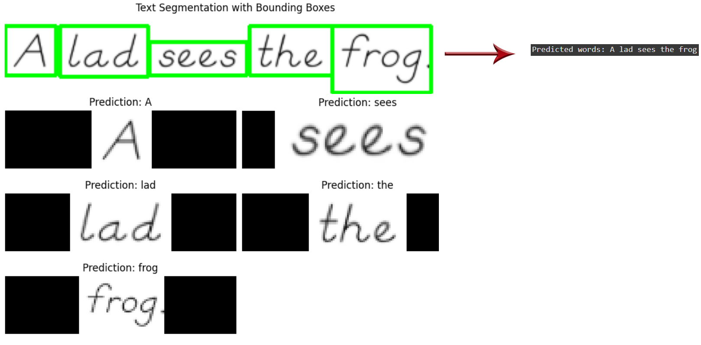

# ✍️ Handwritten Word OCR with Deep Learning

## 📌 Project Overview
This project implements an **Optical Character Recognition (OCR)** system for handwritten words using a **deep learning model** based on a convolutional-recurrent architecture with **CTC loss**. It processes images from the **IAM Handwriting Database**, extracts features, and recognizes text sequences with high accuracy. The model is trained on a large dataset of handwritten words and supports inference on new images, achieving robust performance for handwriting recognition tasks.

---

## 📂 Dataset
- **IAM Handwriting Database**: Contains handwritten word images with transcriptions, downloaded from [IAM Words](https://git.io/J0fjL).
- Image size requirement: ~105x45 pixels (±10 pixels).

---

## 🔍 Project Workflow

### **1. Data Preparation and Preprocessing**
Download, extract, and preprocess the IAM dataset, resizing images to 128x32 pixels while preserving aspect ratios.

```python
import tensorflow as tf
import os
import numpy as np

# Download and extract dataset
!wget -q https://git.io/J0fjL -O IAM_Words.zip
!unzip -qq IAM_Words.zip
!mkdir data
!mkdir data/words
!tar -xf IAM_Words/words.tgz -C data/words
!mv IAM_Words/words.txt data

# Preprocessing function
def distortion_free_resize(image, img_size=(128, 32)):
    w, h = img_size
    image = tf.image.resize(image, size=(h, w), preserve_aspect_ratio=True)
    pad_height = h - tf.shape(image)[0]
    pad_width = w - tf.shape(image)[1]
    pad_height_top = pad_height // 2 + pad_height % 2
    pad_height_bottom = pad_height // 2
    pad_width_left = pad_width // 2 + pad_width % 2
    pad_width_right = pad_width // 2
    image = tf.pad(image, [[pad_height_top, pad_height_bottom], [pad_width_left, pad_width_right], [0, 0]])
    image = tf.transpose(image, perm=[1, 0, 2])
    image = tf.image.flip_left_right(image)
    return image / 255.0
```

### **2. Model Construction**
Build a CNN-BiLSTM model with CTC loss for sequence recognition.

```python
from tensorflow.keras.layers import Input, Conv2D, MaxPooling2D, Reshape, Dense, Dropout, Bidirectional, LSTM
from tensorflow import keras

class CTCLayer(keras.layers.Layer):
    def __init__(self, name=None):
        super().__init__(name=name)
        self.loss_fn = keras.backend.ctc_batch_cost

    def call(self, y_true, y_pred):
        batch_len = tf.cast(tf.shape(y_true)[0], dtype="int64")
        input_length = tf.cast(tf.shape(y_pred)[1], dtype="int64")
        label_length = tf.cast(tf.shape(y_true)[1], dtype="int64")
        input_length = input_length * tf.ones(shape=(batch_len, 1), dtype="int64")
        label_length = label_length * tf.ones(shape=(batch_len, 1), dtype="int64")
        loss = self.loss_fn(y_true, y_pred, input_length, label_length)
        self.add_loss(loss)
        return y_pred

def build_model():
    input_img = Input(shape=(128, 32, 1), name="image")
    labels = Input(name="label", shape=(None,))
    x = Conv2D(32, (3, 3), activation="relu", kernel_initializer="he_normal", padding="same", name="Conv1")(input_img)
    x = MaxPooling2D((2, 2), name="pool1")(x)
    x = Conv2D(64, (3, 3), activation="relu", kernel_initializer="he_normal", padding="same", name="Conv2")(x)
    x = MaxPooling2D((2, 2), name="pool2")(x)
    new_shape = ((128 // 4), (32 // 4) * 64)
    x = Reshape(target_shape=new_shape, name="reshape")(x)
    x = Dense(64, activation="relu", name="dense1")(x)
    x = Dropout(0.2)(x)
    x = Bidirectional(LSTM(128, return_sequences=True, dropout=0.25))(x)
    x = Bidirectional(LSTM(64, return_sequences=True, dropout=0.25))(x)
    x = Dense(len(char_to_num.get_vocabulary()) + 2, activation="softmax", name="dense2")(x)
    output = CTCLayer(name="ctc_loss")(labels, x)
    model = keras.models.Model(inputs=[input_img, labels], outputs=output, name="handwriting_recognizer")
    model.compile(optimizer=keras.optimizers.Adam())
    return model
```

Model Summary:
```
┏━━━━━━━━━━━━━━━━━━━━━┳━━━━━━━━━━━━━━━━━━━┳━━━━━━━━━━━━┳━━━━━━━━━━━━━━━━━━━┓
┃ Layer (type)        ┃ Output Shape      ┃    Param # ┃ Connected to      ┃
┡━━━━━━━━━━━━━━━━━━━━━╇━━━━━━━━━━━━━━━━━━━╇━━━━━━━━━━━━╇━━━━━━━━━━━━━━━━━━━┩
│ image (InputLayer)  │ (None, 128, 32,   │          0 │ -                 │
│                     │ 1)                │            │                   │
├─────────────────────┼───────────────────┼────────────┼───────────────────┤
│ Conv1 (Conv2D)      │ (None, 128, 32,   │        320 │ image[0][0]       │
│                     │ 32)               │            │                   │
├─────────────────────┼───────────────────┼────────────┼───────────────────┤
│ pool1               │ (None, 64, 16,    │          0 │ Conv1[0][0]       │
│ (MaxPooling2D)      │ 32)               │            │                   │
├─────────────────────┼───────────────────┼────────────┼───────────────────┤
│ Conv2 (Conv2D)      │ (None, 64, 16,    │     18,496 │ pool1[0][0]       │
│                     │ 64)               │            │                   │
├─────────────────────┼───────────────────┼────────────┼───────────────────┤
│ pool2               │ (None, 32, 8, 64) │          0 │ Conv2[0][0]       │
│ (MaxPooling2D)      │                   │            │                   │
├─────────────────────┼───────────────────┼────────────┼───────────────────┤
│ reshape (Reshape)   │ (None, 32, 512)   │          0 │ pool2[0][0]       │
├─────────────────────┼───────────────────┼────────────┼───────────────────┤
│ dense1 (Dense)      │ (None, 32, 64)    │     32,832 │ reshape[0][0]     │
├─────────────────────┼───────────────────┼────────────┼───────────────────┤
│ dropout (Dropout)   │ (None, 32, 64)    │          0 │ dense1[0][0]      │
├─────────────────────┼───────────────────┼────────────┼───────────────────┤
│ bidirectional       │ (None, 32, 256)   │    197,632 │ dropout[0][0]     │
│ (Bidirectional)     │                   │            │                   │
├─────────────────────┼───────────────────┼────────────┼───────────────────┤
│ bidirectional_1     │ (None, 32, 128)   │    164,352 │ bidirectional[0]… │
│ (Bidirectional)     │                   │            │                   │
├─────────────────────┼───────────────────┼────────────┼───────────────────┤
│ label (InputLayer)  │ (None, None)      │          0 │ -                 │
├─────────────────────┼───────────────────┼────────────┼───────────────────┤
│ dense2 (Dense)      │ (None, 32, 81)    │     10,449 │ bidirectional_1[…] │
├─────────────────────┼───────────────────┼────────────┼───────────────────┤
│ ctc_loss (CTCLayer) │ (None, 32, 81)    │          0 │ label[0][0],      │
│                     │                   │            │ dense2[0][0]      │
└─────────────────────┴───────────────────┴────────────┴───────────────────┘
 Total params: 424,081 (1.62 MB)
 Trainable params: 424,081 (1.62 MB)
 Non-trainable params: 0 (0.00 B)
```

### **3. Testing and Inference**
Segment and predict text from handwritten images.

```python
import cv2
import tensorflow as tf
import numpy as np
from tensorflow.keras.layers import StringLookup

def preprocess_image(image, img_size=(128, 32)):
    image = tf.convert_to_tensor(image, dtype=tf.float32)
    if len(image.shape) == 2:
        image = tf.expand_dims(image, axis=-1)
    image = distortion_free_resize(image, img_size)
    return image

def split_words(image_path):
    img = cv2.imread(image_path, cv2.IMREAD_GRAYSCALE)
    thresh = cv2.adaptiveThreshold(img, 255, cv2.ADAPTIVE_THRESH_GAUSSIAN_C, cv2.THRESH_BINARY_INV, 11, 2)
    kernel = cv2.getStructuringElement(cv2.MORPH_RECT, (5, 3))
    dilated = cv2.dilate(thresh, kernel, iterations=1)
    contours, _ = cv2.findContours(dilated, cv2.RETR_EXTERNAL, cv2.CHAIN_APPROX_SIMPLE)
    contours = sorted(contours, key=lambda c: cv2.boundingRect(c)[0])
    word_images = []
    for contour in contours:
        x, y, w, h = cv2.boundingRect(contour)
        if w < 10 or h < 10:
            continue
        padding = 5
        x, y, w, h = max(x - padding, 0), max(y - padding, 0), min(w + 2 * padding, img.shape[1] - x), min(h + 2 * padding, img.shape[0] - y)
        word_img = img[y:y+h, x:x+w]
        word_images.append(word_img)
    return word_images

model = tf.keras.models.load_model('handwriting_recognizer.keras', custom_objects={"CTCLayer": CTCLayer})
word_images = split_words('test_image.jpg')
for word_img in word_images:
    image = preprocess_image(word_img)
    image_batch = tf.expand_dims(image, axis=0)
    preds = model.predict(image_batch)
    pred_text = decode_batch_predictions(preds, num_to_chars)[0]
    print(f"Predicted: {pred_text}")
```

---

## 📊 Results
- **Test Result**: 
- **Training Time**: ~9 hours on Google Colab (requires high-performance machine).
- **Model Output**: Robust recognition of handwritten words from segmented images.

---

## 📦 Requirements
```bash
pip install tensorflow opencv-python numpy matplotlib
```

---

## ▶️ How to Run
1. Clone the repository:
   ```bash
   git clone https://github.com/ali27kh/Handwritten_Word_OCR_Deep_Learning.git
   cd Handwritten_Word_OCR_Deep_Learning
   ```
2. Install dependencies.
3. Download and extract the IAM dataset:
   ```bash
   wget -q https://git.io/J0fjL -O IAM_Words.zip
   unzip -qq IAM_Words.zip
   mkdir data
   mkdir data/words
   tar -xf IAM_Words/words.tgz -C data/words
   mv IAM_Words/words.txt data
   ```
4. Train the model (requires high-performance machine, e.g., Google Colab).
5. Test the model.

---

## 📌 Key Insights
- The **CNN-BiLSTM model** with CTC loss effectively handles unsegmented handwritten text sequences.
- The IAM dataset provides diverse handwriting samples, enabling robust model training.
- Image preprocessing (resizing, padding) ensures consistent input dimensions (~105x45 pixels).
- Word segmentation using adaptive thresholding improves inference accuracy for real-world images.

---

## 📜 License
MIT License
